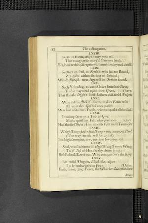

# Page Scan Corrector
Utility for using opencv to detect and reformat page scans, as for OCR.

The program will attempt to crop an image (PNG, JPG) to only major text sections. Preserves color.

## Installation

### Prerequisites

You'll need to install [OpenCV](https://opencv.org/) on your platform. This does not require a bleeding-edge version, so using a package manager version should work (e.g. `brew install opencv` on a Mac).

```
pipenv install
setup.py install --editable .
```

Note that this depends on OpenCV, which may be tricky to install on a given platform.

## Running from the command-line
```
process_image input.png outdir
```

This will write `outdir/input.png` with the result.

## Examples

### Input file


### Output file


## References

This was originally forked from [doc2text](https://github.com/jlsutherland/doc2text).